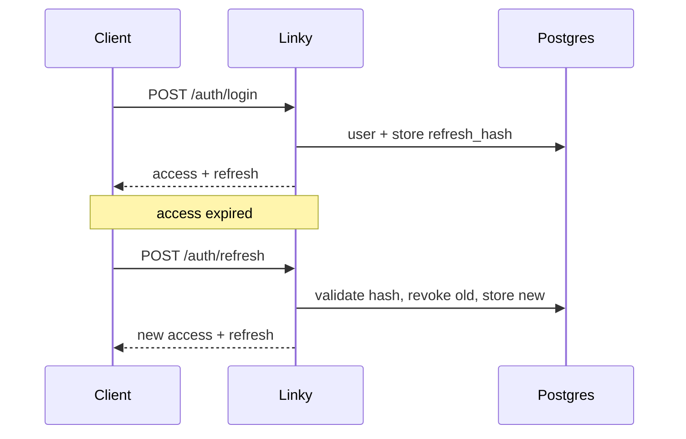

# Decisions (lightweight ADRs)

Record **why**, not only what. One paragraph + mermaid when it helps.

---

## ADR-001 — Fastify + TypeScript (not Nest)

**Status:** accepted  
**Context:** timeline A (2–3 weeks); junior+ signal with auth, Postgres, tests, deploy.  
**Decision:** Fastify + TS ESM; explicit plugins/routes instead of a full framework (Nest).  
**Consequences:** less ceremony and DI; more hand-written code (great for interviews). Nest stays an option if a future team requires it.  
**Alternatives:** Nest, Hono, plain Express.

---

## ADR-002 — ORM: Prisma (not Drizzle)

**Status:** accepted  
**Context:** Postgres is required for the MVP; need migrations and type-safety without stretching timeline A (2–3 weeks). SQL experience is already on the resume; the market gap is a common Node ORM.  
**Decision:** Prisma Client + Prisma Migrate.  
**Consequences:** schema and migrations versioned in the repo; typed client aligned with what teams use in production. Trade Drizzle’s “SQL-like by hand” style for DX and interview familiarity — SQL skill remains, it does not disappear.  
**Alternatives:** Drizzle (more explicit SQL); raw `pg` (max control, slower for the MVP).

---

## ADR-003 — Short-lived access JWT + opaque rotating refresh

**Status:** accepted (design; implement in weeks 1–2)  
**Context:** production-minded auth without OAuth/2FA in the MVP.  
**Decision:** access ~15 min (JWT); opaque refresh, **hashed** in the DB, **rotated** on every use; logout revokes refresh. `GET /:code` redirect is public.  
**Consequences:** a stolen refresh used once invalidates the chain; a stolen access token lives at most until TTL.  
**Out of MVP:** logout all-devices, OAuth, 2FA (see README → Next steps).



---

## Template

```markdown
## ADR-00X — Title

**Status:** proposed | accepted | superseded  
**Context:** …  
**Decision:** …  
**Consequences:** …  
**Alternatives:** …  
```
