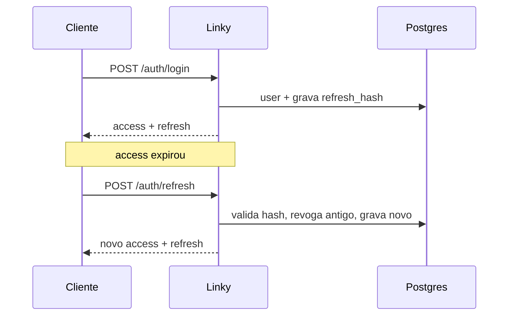

# Decisions (ADR leve)

Registre **por quê**, não só o quê. Um parágrafo + mermaid quando ajudar.

---

## ADR-001 — Fastify + TypeScript (não Nest)

**Status:** accepted  
**Contexto:** prazo A (2–3 semanas); sinal junior+ com auth, Postgres, testes, deploy.  
**Decisão:** Fastify + TS ESM; plugins/rotas explícitas em vez de framework full (Nest).  
**Consequências:** menos cerimônia e DI; mais código “na mão” (ótimo para entrevista). Nest fica como opção se o time futuro exigir.  
**Alternativas:** Nest, Hono, Express puro.

---

## ADR-002 — ORM: Prisma (não Drizzle)

**Status:** accepted  
**Contexto:** Postgres obrigatório no MVP; preciso de migrações e type-safety sem alongar o prazo A (2–3 semanas). Já tenho experiência com SQL no currículo; o gap de mercado é ORM comum em vagas Node.  
**Decisão:** Prisma Client + Prisma Migrate.  
**Consequências:** schema e migrações versionados no repo; client tipado alinhado ao que times usam em produção. Troco o estilo “SQL-like na mão” do Drizzle por DX e familiaridade em entrevista — SQL continua sendo meu, não some.  
**Alternativas:** Drizzle (mais explícito no SQL); `pg` puro (máximo controle, mais lento no MVP).

---

## ADR-003 — Access JWT curto + refresh opaco com rotação

**Status:** accepted (desenho; implementação na Semana 1–2)  
**Contexto:** auth “prod-minded” sem OAuth/2FA no MVP.  
**Decisão:** access ~15 min (JWT); refresh opaco, **hash** no DB, **rotação** a cada uso; logout revoga refresh. Redirect `GET /:code` público.  
**Consequências:** roubo de refresh usado uma vez invalida a cadeia; access roubado vive no máximo o TTL.  
**Fora do MVP:** logout all-devices, OAuth, 2FA (ver README → Próximos passos).



---

## Template

```markdown
## ADR-00X — Título

**Status:** proposed | accepted | superseded  
**Contexto:** …  
**Decisão:** …  
**Consequências:** …  
**Alternativas:** …  
```
