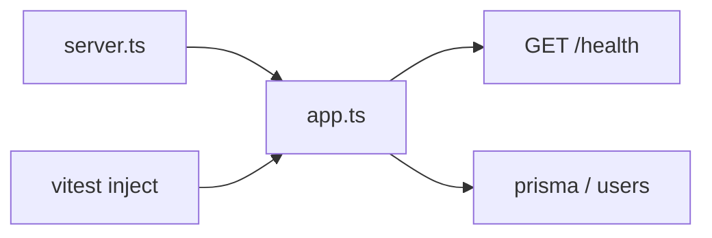

# Roadmap — Linky

Espelha o plano de 3 semanas do portfólio. Uma linha = uma entrega / PR.

| # | Feature | Status | Done quando… | Aprender |
|---|---------|--------|--------------|----------|
| 0 | Skeleton (Fastify + TS + Vitest + health) | ✅ feito | `npm run dev` + `npm test` verdes | app injectável, ESM, scripts |
| 1 | Postgres + ORM + migração `users` | ✅ feito | migrate sobe; conexão ok | schema, migrations, 12-factor `DATABASE_URL` |
| 2 | `POST /auth/register` + `POST /auth/login` | ⬜ próximo | hash (argon2/bcrypt) + access JWT | senha nunca em claro; claims mínimas |
| 3 | Refresh opaco + rotação + `logout` | ⬜ | refresh hash no DB; logout revoga | session theft → rotação |
| 4 | Links: criar / listar / stats | ⬜ | CRUD mínimo autenticado | ownership `user_id` |
| 5 | `GET /:code` → 302 + clicks sync | ⬜ | redirect público; `clicks++` | hot path vs mentira útil (cache/async) |
| 6 | Erros consistentes + rate limit leve | ⬜ | 4xx previsíveis; limite básico em auth | não vazar internals |
| 7 | README afiado + ADRs + deploy | ⬜ | URL pública; clone → roda | accountability de portfólio |

## Semanas (checklist)

| Semana | Itens | Done quando… |
|--------|-------|----------------|
| 1 | #1–#2 | local + migração + testes auth |
| 2 | #3–#5 | fluxo feliz ponta a ponta |
| 3 | #6–#7 | URL pública + testes verdes |

## IN / OUT (lembrete)

**IN:** rotas do README, clicks sync no redirect, rate limit leve, testes, 1–2 ADRs, deploy.  
**OUT:** UI, custom domain, QR, teams, billing, analytics, Redis, microserviços, OAuth, 2FA, logout all-devices.

## Mapa mental (agora)

## Como usar

1. Pegue a próxima linha `⬜`.
2. PR/commit por fatia (`feat: register/login`).
3. Conceito → diagrama → complexidade → código (se pedir ao agente).
4. Atualize Status → ✅; se trade-off mudou, ADR em [DECISIONS.md](DECISIONS.md).
