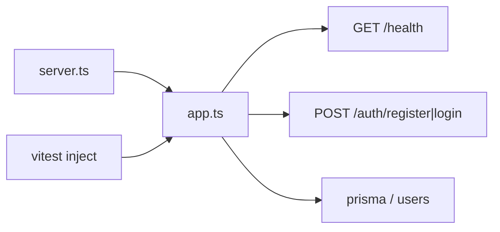

# Roadmap — Linky

Mirrors the 3-week portfolio plan. One row = one delivery / PR.  
Open work lives as GitHub issues [#1](https://github.com/gabriellopessdev/linky/issues/1)–[#6](https://github.com/gabriellopessdev/linky/issues/6) (roadmap items 2–7).

| # | Feature | Status | Done when… | Learn |
|---|---------|--------|------------|-------|
| 0 | Skeleton (Fastify + TS + Vitest + health) | ✅ done | `npm run dev` + `npm test` green | injectable app, ESM, scripts |
| 1 | Postgres + ORM + `users` migration | ✅ done | migrate applies; connection ok | schema, migrations, 12-factor `DATABASE_URL` |
| 2 | `POST /auth/register` + `POST /auth/login` | ✅ done | hash (argon2) + access JWT (jose) | never store plaintext password; minimal claims |
| 3 | Opaque refresh + rotation + `logout` | ⬜ next | refresh hash in DB; logout revokes | session theft → rotation |
| 4 | Links: create / list / stats | ⬜ | minimal authenticated CRUD | ownership via `user_id` |
| 5 | `GET /:code` → 302 + sync clicks | ⬜ | public redirect; `clicks++` | hot path vs useful lie (cache/async) |
| 6 | Consistent errors + light rate limit | ⬜ | predictable 4xx; basic auth limit | don't leak internals |
| 7 | Polished README + ADRs + deploy | ⬜ | public URL; clone → runs | portfolio accountability |

## Weeks (checklist)

| Week | Items | Done when… |
|------|-------|------------|
| 1 | #1–#2 | local + migration + auth tests |
| 2 | #3–#5 | happy path end to end |
| 3 | #6–#7 | public URL + green tests |

## IN / OUT (reminder)

**IN:** routes from the README, sync clicks on redirect, light rate limit, tests, 1–2 ADRs, deploy.  
**OUT:** UI, custom domain, QR, teams, billing, analytics, Redis, microservices, OAuth, 2FA, logout all-devices.

## Mental map (now)

## How to use

1. Pick the next `⬜` row (or the matching GitHub issue).
2. One PR/commit per slice (`feat: register/login`).
3. Concept → diagram → complexity → code.
4. Mark Status → ✅; if a trade-off changed, add an ADR in [DECISIONS.md](DECISIONS.md).
